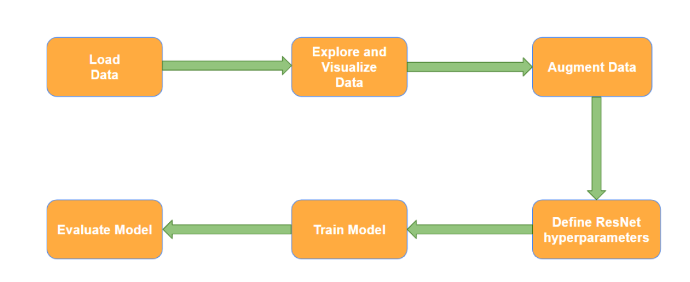

# Pneumonia-Classification-ResNet

This project was part of the course CSE 572: Data Mining under Prof. Yanjie Fu and focussed on classification of Chest X-Ray images as Pneumonic and Non-Pneumonic

Dataset link: https://www.kaggle.com/datasets/paultimothymooney/chest-xray-pneumonia

Members of the Project

1. Nikhil Vijay Yadav
2. Anshul Trivedi
3. Vatsal
4. Shreyas Srinivasan
5. Pavan Ratnakar Shetty

## Data Mining Pipeline of the Project

         

